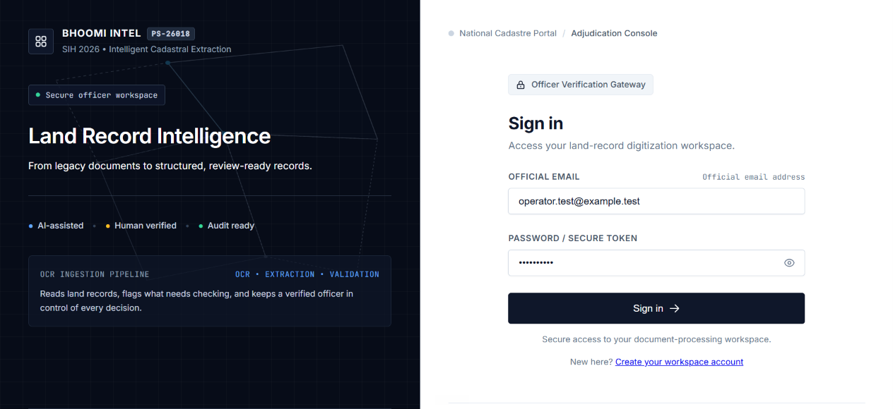
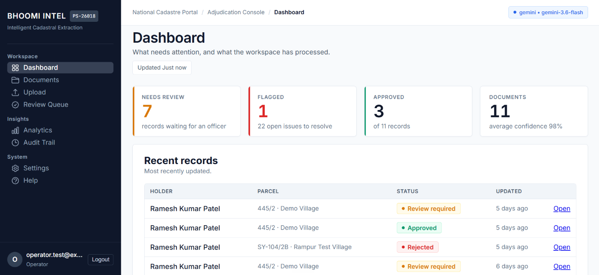
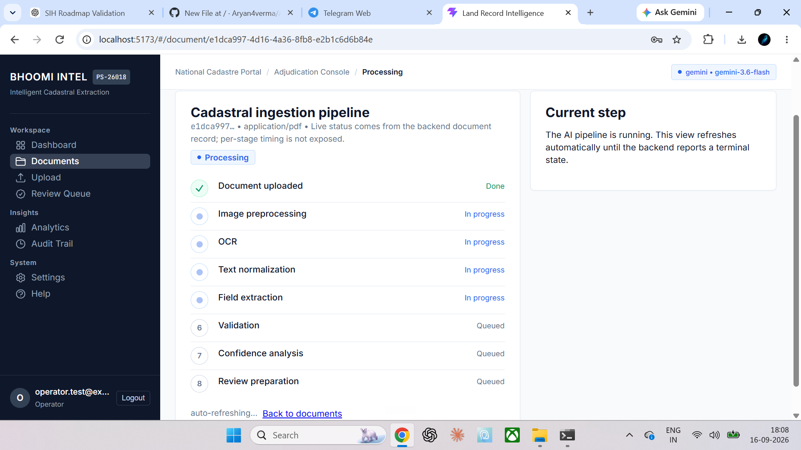

# Intelligent Land Record Digitization and Validation System

### Smart India Hackathon 2026 — Problem Statement 26018

**Team:** VisionTech  
**Category:** Software  
**Theme:** Smart Automation

> Scanned land records → checked, structured data, with a human signature on every record.

---

## Overview

Land-record departments often work with scanned, handwritten, multilingual, and legacy documents that are difficult to search, validate, and convert into structured digital records.

Our solution is an **AI-assisted land record digitization and validation platform** that transforms difficult document files into structured, searchable, and reviewable records.

The system combines:

**OCR + AI-based field extraction + deterministic validation + confidence scoring + human verification + audit trails**

The goal is not to replace the responsible officer. Instead, the system helps the officer process records faster while keeping human review and approval in the workflow.

---

## Problem Statement

Legacy land records may contain:

- Scanned documents
- Poor-quality document images
- Multiple languages
- Inconsistent formats
- Difficult-to-read text
- Important land and ownership fields spread across the document
- Data that requires manual verification

Manually entering and checking these records can be time-consuming and makes traceability difficult.

A reliable digitization system therefore needs to do more than OCR. It should also identify important fields, validate them, highlight uncertainty, and maintain a record of human decisions.

---

## Proposed Solution

Our platform provides an end-to-end workflow:

```text
Land Record Document
        ↓
Upload
        ↓
Document Validation
        ↓
Page Rendering / Preprocessing
        ↓
OCR
        ↓
Structured Field Extraction
        ↓
Validation Rules
        ↓
Confidence / Risk Assessment
        ↓
Human Review
        ↓
Correction / Approval / Rejection
        ↓
Structured Record
        ↓
Audit Trail
        ↓
Search / Dashboard / API

The system is designed around a human-in-the-loop workflow, so uncertain or invalid information can be reviewed before final approval.

Key Features
Document Ingestion
Upload land-record documents through the web application
Validate uploaded files before processing
Support PDF-based document workflows
Maintain document metadata and processing status
OCR and Document Processing
PDF page rendering using PyMuPDF
OCR using Tesseract
English, Hindi, and Gujarati OCR configuration
OCR output retained as part of the processing pipeline
AI-Assisted Extraction

The system converts OCR output into structured land-record fields.

The current prototype extracts 14 fields, including examples such as:

Survey Number
Hissa
Khata
Khasra
Owner
Father / Guardian
Area / Extent
Land Classification
Mutation Reference
Record Date
Related cultivation information
Validation

The extracted information is checked using deterministic validation rules.

The current prototype contains 13 coded validation rules covering checks such as:

Required-field validation
Format validation
Reference-data validation
Consistency checks
Review-required conditions
Confidence and Human Review

AI confidence is treated as an uncertainty signal, not as proof of correctness.

Records can be reviewed and corrected by an authorized operator before approval.

Audit Trail

Important workflow actions are recorded so that the lifecycle of a record can be traced.

The workflow can therefore move from:

Upload → Process → Extract → Validate → Review → Correct → Approve

while retaining the associated audit information.

Role-Based Access

The application supports role-aware access so users only receive the actions appropriate to their role.

Technology Stack
Layer	Technology
Frontend	React 19 + Vite 8
Backend	FastAPI + Uvicorn
Database	PostgreSQL 17.6
Authentication	JWT (HS256) + bcrypt
OCR	Tesseract 5.4
PDF Processing	PyMuPDF
AI Extraction	Gemini with OpenRouter fallback
Storage	Private object storage
API	REST
Testing	Vitest + Python backend tests
Architecture
┌─────────────────────────────┐
│        React Frontend       │
│  Login / Upload / Review /  │
│  Records / Dashboard / UI   │
└──────────────┬──────────────┘
               │
               │ REST API
               ▼
┌─────────────────────────────┐
│       FastAPI Backend       │
│                             │
│ Auth & RBAC                 │
│ Document Processing         │
│ OCR                         │
│ AI Extraction               │
│ Validation                  │
│ Review Workflow             │
│ Audit Logging               │
└──────────────┬──────────────┘
               │
       ┌───────┴────────┐
       ▼                ▼
┌─────────────┐   ┌──────────────┐
│ PostgreSQL  │   │Private Storage│
│ Structured  │   │   Documents   │
│ Records     │   │               │
│ Validation  │   └──────────────┘
│ Audit Data  │
└─────────────┘
End-to-End Workflow
1. Sign In

An authorized user signs into the application.

2. Upload Document

The land-record document is uploaded through the web interface.

3. Process Document

The backend validates and processes the document.

4. OCR

The document pages are rendered and passed through the OCR pipeline.

5. AI Extraction

OCR output is converted into the required structured fields.

6. Validation

Extracted values are checked using coded validation rules and reference checks.

7. Confidence Assessment

The system identifies information that may require additional human attention.

8. Human Review

An authorized operator can inspect the extracted information and correct fields when required.

9. Approval or Rejection

The record can be approved or rejected according to the review workflow.

10. Storage and Audit

The resulting structured record and relevant workflow information are persisted in the database with audit information.

Demo Mode

The project includes a controlled Demo Mode for reliable hackathon demonstrations.

Demo Mode uses prepared document fixtures and predefined processing results rather than external AI calls for those known demo documents.

This provides:

Predictable demonstrations
No dependency on external AI quota for demo fixtures
Repeatable results
The same validation and review workflow used by the application

The important distinction is:

Demo Mode

Controlled fixture
       ↓
Normal backend workflow
Live Mode

Real document
       ↓
OCR
       ↓
AI extraction
       ↓
Normal backend workflow

Demo Mode is intended for demonstration and testing. It is not presented as a replacement for live document processing.

Security

Security is considered throughout the application workflow.

Current controls include:

Password hashing with bcrypt
JWT-based authentication
Role-aware authorization
Private document storage
File validation using file signatures / magic bytes
Failed-login protection
Server-side authorization checks
Audit logging
Environment-based secret configuration
Database access controls

Sensitive credentials and API keys are not intended to be stored in the source repository.

Validation Philosophy

A core design principle of this project is:

AI confidence is not the same as correctness.

An AI model can produce a highly confident result that is still incorrect.

Therefore, the system separates:

AI Extraction
      ↓
Confidence
      ↓
Deterministic Validation
      ↓
Human Review
      ↓
Final Decision

This approach is intended to make the system more transparent and safer for workflows where record accuracy matters.

Evaluation Results

The current prototype has been evaluated using synthetic/specimen documents and repository test fixtures.

The reported evaluation figures are therefore prototype measurements, not public benchmark results or measurements from a government land-record archive.

Current Measurements
Metric	Prototype Result
Field extraction accuracy	98.2%
Correct field decisions	55 / 56
OCR character error rate	0.267 → 0.086
OCR CER change	Approximately -68%
Script/language routing	11 / 11
Automated tests	414
Upload → reviewable record	~11.5 seconds
Structured fields	14
Validation rules	13
Field-Level Evaluation

In the current evaluation:

survey_number: 75%
Other 13 evaluated fields: 100%

These figures are based on the project's current evaluation fixtures and should not be interpreted as production accuracy across all historical land records.

What the Prototype Demonstrates

The current system demonstrates a complete software workflow from document ingestion to validated and reviewable structured data.

Demonstrated
Document upload
Document processing
OCR
AI-assisted extraction
14-field structured output
Validation rules
Confidence handling
Human review
Correction workflow
Approval/rejection workflow
Database persistence
Audit trail
Role-aware access
REST API
Controlled Demo Mode
Current Boundaries

The prototype does not claim to provide:

Legal determination of land ownership
Direct production integration with government LRMS/DILRMP systems
Complete coverage of every historical land-record format
Proven handwriting accuracy across real-world archives
Production-scale concurrency or load testing
Government reference databases in the demonstration environment

These areas are part of the planned evolution of the system.

Project Structure

A simplified view of the project:

Ai-land-records/
│
├── frontend/
│   └── React application
│
├── backend/
│   └── FastAPI application
│
├── database/
│   └── Database / SQL related files
│
├── docs/
│   └── Project documentation
│
├── tests/
│   └── Automated tests
│
├── README.md
├── data_processing.png
├── home_page.png
├── login_page.png
└── ...

The exact repository structure may contain additional implementation and configuration files.

Screenshots
Login Page

Home Page

Data Processing

API and Backend

The backend is implemented using FastAPI and exposes REST endpoints for the application's workflow.

The backend is responsible for:

Authentication
Authorization
Document processing
OCR orchestration
AI extraction
Validation
Record persistence
Review workflow
Audit information
Dashboard / record data

The API layer keeps the frontend separate from the underlying processing and database logic.

Database

The application uses PostgreSQL for structured storage.

The database stores information related to:

Users
Documents
Processing jobs
OCR results
Structured records
Extracted fields
Validation results
Review workflow
Audit information
Supporting reference data

The prototype currently uses 12 database tables.

Why This Approach

The novelty of the prototype is not OCR alone.

The solution combines multiple stages into one workflow:

OCR
 +
AI extraction
 +
Validation rules
 +
Confidence handling
 +
Human review
 +
Audit trail
 =
Land-record digitization workflow

This makes the system focused on the operational problem of turning difficult documents into reviewable structured records, rather than simply extracting text.

Future Roadmap
Phase 1 — Hardening and Evaluation
Expand evaluation datasets
Improve OCR preprocessing
Improve extraction robustness
Calibrate confidence scores
Strengthen validation coverage
Improve correction and audit workflows
Phase 2 — Controlled Pilot
Support additional document formats
Expand multilingual document handling
Test with larger controlled datasets
Improve operational dashboards
Introduce stronger reference-data workflows
Phase 3 — Integration and Scale
Government-system integration where officially permitted
LRMS / DILRMP integration
GIS and cadastral-map integration
Larger-scale processing infrastructure
Advanced matching and duplicate detection
Broader deployment and monitoring
Responsible Use

This system is designed as an AI-assisted decision-support and digitization tool.

It does not independently determine legal ownership or replace the authority of a responsible land-record officer.

Human verification remains an important part of the workflow, particularly where extracted information is uncertain or conflicting.

Team
VisionTech

Smart India Hackathon 2026

Problem Statement: 26018
Problem: Intelligent Land Record Digitization and Validation System
Category: Software
Theme: Smart Automation

Team member names and individual roles can be added here.

References
Smart India Hackathon — Problem Statement 26018
Tesseract OCR
Unicode Standard
Digital India Land Records Modernization Programme (DILRMP)
Digital Personal Data Protection Act, 2023
PostgreSQL Row-Level Security documentation
Disclaimer

This repository contains a hackathon prototype.

The evaluation results shown above are based on the project's current synthetic/specimen fixtures and automated tests. They are not presented as official government benchmark results.

The prototype does not establish legal ownership, does not claim production government integration, and should not be used as a substitute for official land-record verification or legal processes.

License

This project was developed as part of Smart India Hackathon 2026.

Add the project's license information here if a formal open-source license is selected.
