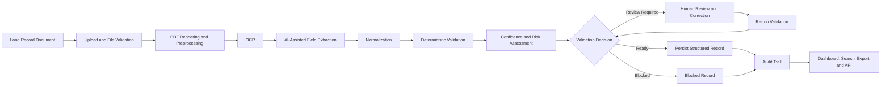
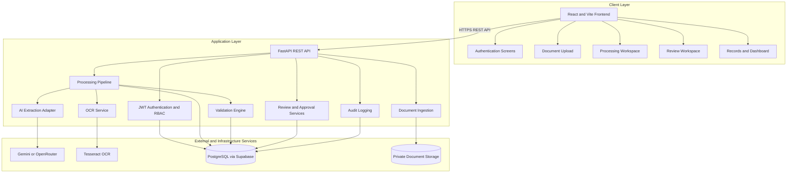
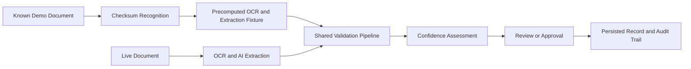

# Intelligent Land Record Digitization and Validation System

### Smart India Hackathon 2026 · Problem Statement 26018 · Team VisionTech
                                    website link - https://aryanverma21.vercel.app/

> From scanned land records to structured, validated, reviewable, and traceable digital records.

<p align="center">
  
  
  
  
</p>

An AI-assisted platform for digitizing difficult land-record documents through OCR, structured field extraction, deterministic validation, confidence assessment, human review, approval workflows, and audit trails.

---

## Table of Contents

- [Problem](#problem)
- [Solution](#solution)
- [End-to-End Workflow](#end-to-end-workflow)
- [Key Features](#key-features)
- [Architecture](#architecture)
- [Prototype Evaluation](#prototype-evaluation)
- [Technology Stack](#technology-stack)
- [Repository Structure](#repository-structure)
- [Quick Start](#quick-start)
- [Testing](#testing)
- [Documentation](#documentation)
- [Security](#security)
- [Responsible Use](#responsible-use)
- [Current Limitations](#current-limitations)
- [Team](#team)

---

## Problem

Land records are often stored as scanned, handwritten, multilingual, low-quality, and inconsistently formatted documents.

Traditional OCR can extract text, but text extraction alone does not guarantee that the resulting land data is:

- Correct
- Complete
- Consistent
- Structurally usable
- Ready for official review
- Traceable through an audit history

A reliable digitization system must therefore combine OCR with structured extraction, validation, confidence analysis, and human oversight.

---

## Solution

This platform converts uploaded land-record documents into structured and reviewable digital records while keeping authorized human operators in control.

### Core Principle

> **AI proposes. Rules validate. Humans decide.**

The current prototype supports structured extraction across 14 land-record fields, including:

- Owner name
- Survey number
- Khasra number
- Khata number
- Area
- Village
- Tehsil
- District
- Land classification
- Mutation details
- Registration information
- Record dates
- Additional document metadata

AI confidence is treated as an uncertainty signal, not as proof of correctness.

---

## End-to-End Workflow



The workflow is designed so that uncertain or conflicting records are surfaced for review instead of being silently accepted.

---

## Key Features

### Document Ingestion

- PDF and image document upload
- File size, MIME type, and content validation
- Document checksum tracking
- Page rendering and preprocessing
- Processing status tracking
- Controlled demo mode for known fixtures

### OCR and AI-Assisted Extraction

- OCR-based text extraction
- Structured extraction into defined land-record fields
- Field-level confidence and metadata
- Provider-independent AI abstraction
- Gemini integration
- OpenRouter fallback support
- No foundation-model training required

### Deterministic Validation

Validation runs independently from the AI model and can check:

- Required fields
- Field formats
- Numeric and date formats
- Cross-field consistency
- Geographic reference data
- Duplicate records
- Invalid or conflicting values
- Review-required conditions

### Human-in-the-Loop Review

Authorized operators can:

1. Review extracted values
2. Inspect validation findings
3. Correct fields
4. Re-run validation
5. Approve or reject records

This prevents AI-generated output from becoming final without appropriate verification.

### Role-Based Access Control

The system separates permissions between:

- Read-only users
- Operators
- Administrators

Review, correction, upload, processing, and approval permissions are enforced on the backend.

### Auditability

The system records important workflow events, including:

- Document ingestion
- Processing status changes
- Validation results
- Field corrections
- Review decisions
- Approval or rejection actions
- Record lifecycle events

### Search and Dashboard

The frontend provides operational views for:

- Document records
- Processing status
- Review queues
- Validation findings
- Approved records
- Audit history
- Analytics and summary information

---

## Architecture



The frontend communicates with the FastAPI backend through REST endpoints. Business rules, authorization, validation, persistence, and audit behavior remain server-controlled.

---

## Controlled Demo Mode

The backend supports a controlled demonstration path for known documents.



Demo mode is designed for reliable demonstrations without depending on provider quota, network variability, or model randomness.

The downstream validation, confidence, review, approval, persistence, and audit workflow remains part of the same application pipeline.

---

## Prototype Evaluation

The current prototype evaluation uses `dataset_v1` with four specimen documents.

| Measurement | Result |
|---|---:|
| Field extraction accuracy | **98.21%** |
| Correct field decisions | **55 / 56** |
| Structured fields | **14** |
| Evaluation documents | **4** |
| Validation outcomes | **1 Ready · 2 Review · 1 Blocked** |

The `98.21%` result is a prototype measurement from the current evaluation fixtures. It is not a production accuracy claim or a government archival benchmark.

The current evaluation identified:

- `survey_number`: 75%
- Other evaluated fields: 100%

Real-world deployment would require a larger, representative, independently annotated evaluation dataset.

---

## Technology Stack

| Layer | Technology |
|---|---|
| Frontend | React 19, Vite 8 |
| Backend | FastAPI, Uvicorn |
| Database | PostgreSQL via Supabase |
| Authentication | JWT and bcrypt |
| OCR | Tesseract and pytesseract |
| PDF Processing | PyMuPDF |
| Image Processing | Pillow and NumPy |
| AI Extraction | Gemini with OpenRouter fallback |
| Storage | Private object storage |
| API | REST |
| Frontend Testing | Vitest |
| Backend Testing | Pytest |

---

## Repository Structure

```text
AI_Land_Record/
├── frontend/                 # React and Vite application
├── backend/                  # FastAPI backend
│   ├── app/
│   └── tests/
├── ai/                       # OCR, extraction, validation, and confidence logic
├── dataset/                  # Documents, ground truth, and evaluation outputs
├── demo/                     # Controlled demonstration fixtures
├── scripts/                  # Evaluation and utility scripts
├── supabase/                 # Database migrations and generated types
├── stitch-reference/         # UI reference material
│
├── README.md
├── Dockerfile
├── DEPLOYMENT.md
├── 00_MASTER.md
├── 01_PROBLEM_RESEARCH.md
├── 02_PRD.md
├── 03_USER_FLOW.md
├── 04_DATA_DICTIONARY.md
├── 05_DATASET_AND_ANNOTATION.md
├── 06_AI_ARCHITECTURE.md
├── 07_AI_MODEL_STRATEGY.md
├── 08_VALIDATION_SPECIFICATION.md
├── 09_DATABASE_SCHEMA.md
├── 10_API_SPECIFICATION.md
├── 11_SECURITY_DESIGN.md
├── 12_EVALUATION_AND_TESTING.md
├── 13_DEPLOYMENT_RUNBOOK.md
└── 14_UI_UX_SPECIFICATION.md
```

---

## Quick Start

### Prerequisites

Install the following before running the project:

- Python 3.11 or newer
- Node.js 20 or newer
- npm
- Tesseract OCR
- PostgreSQL/Supabase access
- Git

Tesseract must be installed separately because `pytesseract` is a Python interface to the Tesseract executable.

### 1. Clone the Repository

```bash
git clone https://github.com/Aryan4verma/AI_Land_Record.git
cd AI_Land_Record
```

### 2. Configure the Backend

```bash
cd backend
python -m venv .venv
```

Windows:

```powershell
.\.venv\Scripts\Activate.ps1
```

macOS/Linux:

```bash
source .venv/bin/activate
```

Install backend dependencies:

```bash
pip install -r requirements.txt
```

Create the backend environment file.

Windows:

```powershell
Copy-Item ..\.env.example .env
```

macOS/Linux:

```bash
cp ../.env.example .env
```

Update the environment file with the required server-side configuration, including:

- `AUTH_SECRET`
- Supabase URL
- Supabase anonymous key
- Supabase service-role key
- AI provider keys, if live extraction is enabled
- Storage configuration

Never place backend secrets in frontend code or commit them to Git.

Start the backend:

```bash
python -m uvicorn app.main:app --reload --port 8000
```

The backend will be available at:

```text
http://localhost:8000
```

FastAPI documentation:

```text
http://localhost:8000/docs
```

### 3. Start the Frontend

Open a second terminal:

```bash
cd frontend
npm install
npm run dev
```

The frontend will be available at:

```text
http://localhost:5173
```

---

## Testing

### Frontend

```bash
cd frontend
npm test
npm run typecheck
npm run lint
npm run build
```

### Backend

```bash
cd backend
python -m pytest -q
```

The test suite covers authentication, document ingestion, processing, validation, review workflows, audit behavior, and API contracts.

---

## API Overview

The backend exposes versioned REST endpoints under `/api/v1`.

Major API areas include:

- Authentication
- Document upload and retrieval
- Document processing
- OCR and extraction results
- Validation findings
- Review queues
- Approval and rejection
- Audit history
- Dashboard and analytics data
- Reference data

The complete API contract is documented in [10_API_SPECIFICATION.md](./10_API_SPECIFICATION.md).

---

## Security

The system follows a server-authoritative security model.

Security measures include:

- JWT-based authentication
- bcrypt password hashing
- Backend-enforced role authorization
- Private document storage
- File signature and content validation
- Environment-based secret configuration
- Request validation
- Audit logging
- Server-side ownership and permission checks
- Protected review and approval actions
- Safe error responses
- No trust in browser-provided roles or permissions
- No automatic trust in raw document content or AI-generated output

> Never trust the browser, raw document content, or AI output without server-side validation.

---

## Documentation

Detailed engineering documentation is available here:

- [Master Project Source of Truth](./00_MASTER.md)
- [Problem Research](./01_PROBLEM_RESEARCH.md)
- [Product Requirements](./02_PRD.md)
- [User Flow](./03_USER_FLOW.md)
- [Data Dictionary](./04_DATA_DICTIONARY.md)
- [Dataset and Annotation](./05_DATASET_AND_ANNOTATION.md)
- [AI Architecture](./06_AI_ARCHITECTURE.md)
- [AI Model Strategy](./07_AI_MODEL_STRATEGY.md)
- [Validation Specification](./08_VALIDATION_SPECIFICATION.md)
- [Database Schema](./09_DATABASE_SCHEMA.md)
- [API Specification](./10_API_SPECIFICATION.md)
- [Security Design](./11_SECURITY_DESIGN.md)
- [Evaluation and Testing](./12_EVALUATION_AND_TESTING.md)
- [Deployment Runbook](./13_DEPLOYMENT_RUNBOOK.md)
- [UI/UX Specification](./14_UI_UX_SPECIFICATION.md)
- [Deployment Guide](./DEPLOYMENT.md)

---

## Responsible Use

This project is an AI-assisted digitization and decision-support system.

It does not independently determine legal ownership and must not replace:

- Official land-record authorities
- Government verification procedures
- Legal review
- Human adjudication
- Production LRMS or DILRMP systems

Human verification remains essential when extracted information is uncertain, inconsistent, incomplete, or blocked by validation rules.

---

## Current Limitations

The current prototype does not claim:

- Complete coverage of every historical land-record format
- Reliable handwriting accuracy across all real-world archives
- Support for every Indian language or script
- Production-scale concurrency
- Nationwide deployment readiness
- Direct production integration with government LRMS/DILRMP systems
- Legal determination of land ownership
- Production accuracy based only on the current four-document evaluation set

These are future expansion areas rather than capabilities claimed by the current prototype.

---

## Team VisionTech

**Smart India Hackathon 2026**

- **Problem Statement:** 26018
- **Problem:** Intelligent Land Record Digitization and Validation System
- **Category:** Software
- **Theme:** Smart Automation

---

<p align="center">
  <strong>OCR is only the beginning.</strong><br>
  The goal is a validated, reviewable, and traceable digital land record.
</p>
