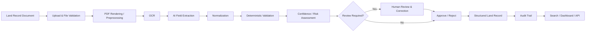
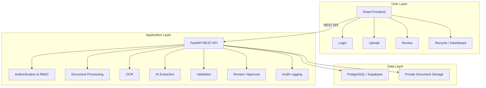
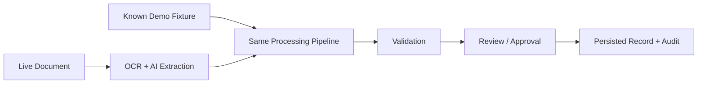

# Intelligent Land Record Digitization and Validation System

### Smart India Hackathon 2026 · Problem Statement 26018 · Team VisionTech

> **From scanned land records to structured, validated, and reviewable digital records.**

<p align="center">
  
  
  
  
</p>

An AI-assisted platform for digitizing difficult land-record documents using **OCR, structured field extraction, deterministic validation, confidence assessment, human review, and audit trails**.

---

## The Problem

Land records can exist as scanned, handwritten, multilingual, low-quality, and inconsistently formatted documents. OCR alone can extract text, but it does not guarantee that the extracted land data is **correct, complete, consistent, or ready for official review**.

The system therefore goes beyond OCR:

**Document → OCR → AI extraction → Validation → Confidence → Human Review → Approval → Audit**

---

## Our Solution

The platform converts an uploaded land-record document into a **structured and reviewable digital record** while keeping the responsible human operator in control.

### Core Idea

> **AI proposes. Rules validate. Humans decide.**

The current prototype supports structured extraction across **14 land-record fields**, including owner, survey number, khasra, khata, area, village, tehsil, district, classification, mutation, registration and record-date information.

---

## End-to-End Workflow



The important design principle is that **AI confidence is treated as an uncertainty signal, not as proof of correctness**.

---

## What Makes the Approach Different

| Traditional OCR                    | This System                                   |
| ---------------------------------- | --------------------------------------------- |
| Extracts text                      | Extracts structured land-record fields        |
| Stops after OCR                    | Continues through validation                  |
| AI output may be accepted directly | Deterministic rules check extracted data      |
| Errors can remain hidden           | Confidence and validation issues are surfaced |
| Manual work is disconnected        | Human review is part of the workflow          |
| Limited traceability               | Corrections and decisions are auditable       |

The novelty is therefore **the combination of the stages into one operational workflow**, rather than OCR alone.

---

## Architecture



---

## Core Features

### Document Processing

* PDF/document upload and validation
* Page rendering and preprocessing
* OCR pipeline with multilingual configuration
* Processing status tracking

### AI-Assisted Extraction

* Converts OCR output into structured land-record data
* Field-level confidence and extraction metadata
* Provider-independent AI service design
* Gemini with OpenRouter fallback support

### Deterministic Validation

Validation is performed independently from the AI model using rules such as:

* Required-field checks
* Format checks
* Cross-field consistency
* Reference-data checks
* Duplicate detection
* Review-required conditions

### Human-in-the-Loop Review

Authorized operators can:

**Review → Correct → Complete → Approve / Reject**

This prevents extracted information from being treated as final merely because an AI model produced it.

### Auditability

Important workflow actions, corrections, review decisions, and record changes can be traced through audit information.

### Role-Based Access

The application separates permissions for read-only users and operators, with review and approval actions protected by backend authorization.

---

## Prototype Evidence

The current evaluation uses **`dataset_v1` with 4 specimen documents** and is explicitly not presented as a government archival benchmark.

| Measurement                 |                     Current Result |
| --------------------------- | ---------------------------------: |
| Field extraction accuracy   |                         **98.21%** |
| Correct field decisions     |                        **55 / 56** |
| Structured fields           |                             **14** |
| Documents in evaluation set |                              **4** |
| Validation outcomes         | **1 Ready · 2 Review · 1 Blocked** |

The 98.21% result is a prototype measurement from the current evaluation fixtures. `survey_number` was 75%, while the other 13 evaluated fields were 100%.

> **Note:** These numbers are prototype measurements from the current evaluation fixtures, not production accuracy across real government land-record archives.

---

## Controlled Execution

The backend supports a controlled execution path for known fixtures while keeping the downstream processing workflow consistent.



The key point is that the downstream **validation, confidence, persistence, review, approval, and audit workflow remains part of the same application flow**.

---

## Technology Stack

| Layer          | Technology                   |
| -------------- | ---------------------------- |
| Frontend       | React 19 + Vite 8            |
| Backend        | FastAPI + Uvicorn            |
| Database       | PostgreSQL / Supabase        |
| Authentication | JWT + bcrypt                 |
| OCR            | Tesseract                    |
| PDF Processing | PyMuPDF                      |
| AI Extraction  | Gemini + OpenRouter fallback |
| Storage        | Private object storage       |
| API            | REST                         |
| Testing        | Vitest + Pytest              |

---

## Security by Design

The prototype incorporates:

* JWT-based authentication
* Backend-enforced role authorization
* bcrypt password hashing
* Private document storage
* File signature / content validation
* Environment-based secret configuration
* Audit logging
* Server-side permission checks
* Protection against trusting raw document content or AI output without validation

> **Never trust the browser, raw document content, or AI output without appropriate server-side controls and validation.**

---

## Repository Structure

```text
AI_Land_Record/
│
├── frontend/              # React + Vite application
├── backend/               # FastAPI backend
│   ├── app/
│   └── tests/
├── ai/                    # OCR, extraction, validation, confidence
├── dataset/               # Documents, ground truth, outputs, evaluation
├── supabase/              # Database migrations and types
├── scripts/               # Evaluation / utility scripts
│
├── data_processing.png
├── home_page.png
├── login_page.png
│
├── 00_MASTER.md
├── 01_PROBLEM_RESEARCH.md
├── 04_DATA_DICTIONARY.md
├── 06_AI_ARCHITECTURE.md
├── 08_VALIDATION_SPECIFICATION.md
├── 09_DATABASE_SCHEMA.md
├── 10_API_SPECIFICATION.md
├── 11_SECURITY_DESIGN.md
├── 12_EVALUATION_AND_TESTING.md
├── 13_DEPLOYMENT_RUNBOOK.md
└── README.md
```

---

## Quick Start

### 1. Clone

```bash
git clone https://github.com/Aryan4verma/AI_Land_Record.git
cd AI_Land_Record
```

### 2. Backend

```bash
cd backend
python -m venv .venv

# Windows
.venv\Scripts\activate

pip install -r requirements.txt
```

Configure the required values from the root `.env.example`, then run:

```bash
python -m uvicorn app.main:app --reload --port 8000
```

### 3. Frontend

```bash
cd frontend
npm install
npm run dev
```

### 4. OCR

Tesseract OCR must be installed on the machine because `pytesseract` acts as the Python interface to the OCR engine.

---

## Documentation

The repository includes detailed engineering specifications for the major subsystems:

* [AI Architecture](./06_AI_ARCHITECTURE.md)
* [Validation Specification](./08_VALIDATION_SPECIFICATION.md)
* [Database Schema](./09_DATABASE_SCHEMA.md)
* [API Specification](./10_API_SPECIFICATION.md)
* [Security Design](./11_SECURITY_DESIGN.md)
* [Evaluation & Testing](./12_EVALUATION_AND_TESTING.md)
* [Deployment Runbook](./13_DEPLOYMENT_RUNBOOK.md)

---

## Responsible Use

This is an **AI-assisted digitization and decision-support system**.

It does not independently determine legal ownership and is not intended to replace official land-record authorities, legal verification, or government systems.

Human verification remains part of the workflow, particularly when extracted information is uncertain, inconsistent, or blocked by validation rules.

---

## Current Boundaries

The prototype does not claim:

* Complete coverage of every historical land-record format
* Proven handwriting accuracy across real-world archives
* Production-scale concurrency or load testing
* Direct production integration with government LRMS/DILRMP systems
* Legal determination of land ownership

These are future expansion areas rather than capabilities claimed by the current prototype.

---

## Team VisionTech

**Smart India Hackathon 2026**
**Problem Statement:** 26018
**Problem:** Intelligent Land Record Digitization and Validation System
**Category:** Software
**Theme:** Smart Automation

---

<p align="center">
  <b>OCR is only the beginning.</b><br>
  <b>The goal is a validated, reviewable, and traceable digital land record.</b>
</p>
